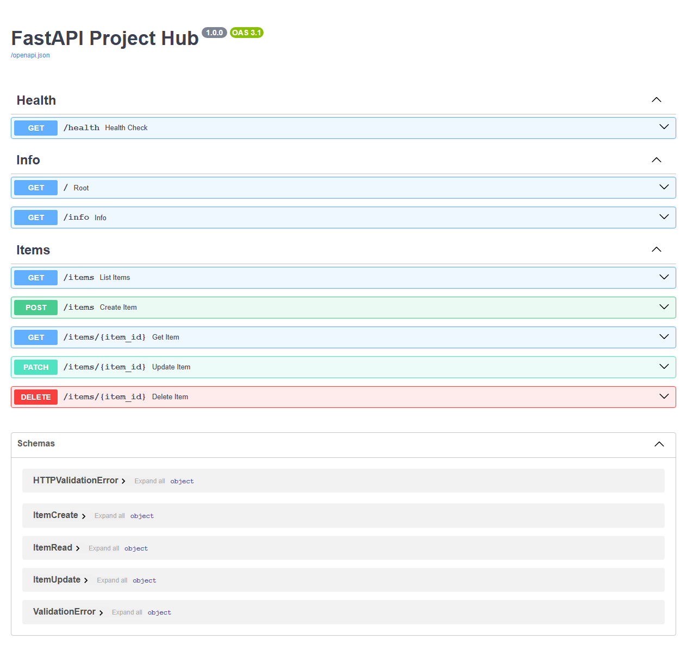
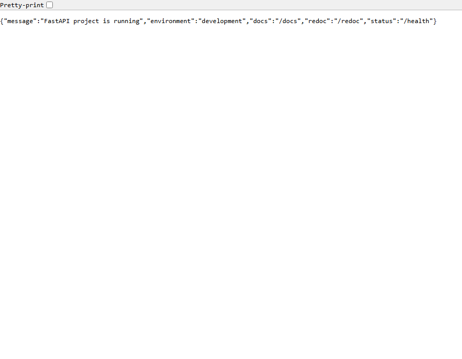
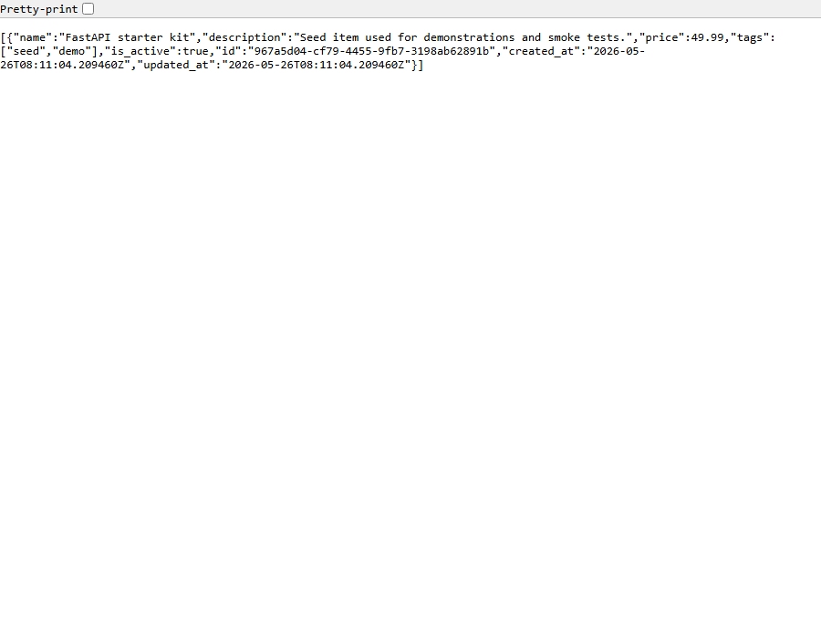
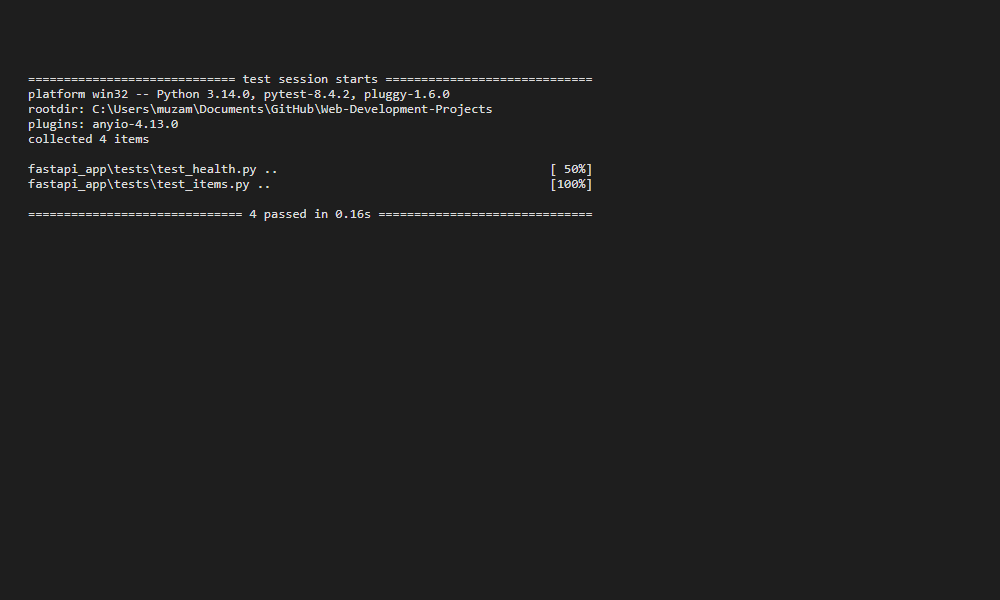

# FastAPI App

- A package-based FastAPI app with a clean `app/` layout.
- Basic configuration loaded from environment variables.
- A small in-memory item service with CRUD endpoints.
- Health and info endpoints for quick checks.
- Automated tests for the core API flow.

## Run locally (detailed)

These steps show how to create a virtual environment, install dependencies, run the app, and run tests. It is recommended to use a repository-level virtual environment (at the repository root, commonly named `.venv`) or rather than a project-level virtual environment inside `fastapi_app/.venv`.

1) Create and activate a virtual environment

- Recommended (repo-level `.venv` shared across projects): from the repository root

```bash
python -m venv .venv
# macOS / Linux
source .venv/bin/activate
# Windows PowerShell
.venv\Scripts\Activate.ps1
# Windows (cmd.exe)
.venv\Scripts\activate.bat
```

2) Install dependencies

```bash
pip install --upgrade pip
pip install -r requirements.txt
```

3) Run the app (development)

```bash
# from repository root
uvicorn app.main:app --reload

```

You can also run the simple entrypoint:

```bash
python main.py
```

4) Run tests

```bash
# from repository root
python -m pytest fastapi_app/tests
```

5) Docker (optional)

```bash
docker build -t fastapi-app .
docker run --rm -p 8000:8000 fastapi-app
```

Note: commands assume the active virtual environment's `python` and `pip` are used. Use explicit paths if you prefer (for example, `.venv\Scripts\python.exe` on Windows).

## Environment

Copy [.env.example](.env.example) to `.env` if you want to override the default app metadata or debug settings.

## Docker

```bash
docker build -t fastapi-app .
docker run --rm -p 8000:8000 fastapi-app
```
## Endpoints

- `GET /` - project summary
- `GET /health` - health check
- `GET /info` - app metadata
- `GET /items` - list items
- `POST /items` - create an item
- `GET /items/{item_id}` - fetch one item
- `PATCH /items/{item_id}` - update an item
- `DELETE /items/{item_id}` - delete an item

## Structure

- `app/core/` - settings and shared configuration
- `app/api/` - route dependencies and routers
- `app/schemas/` - request and response models
- `app/services/` - in-memory business logic
- `tests/` - API tests

## Visual examples

Below are visual captures of common application states. If the images are missing, run the capture scripts in `fastapi_app/scripts/`.

- Swagger UI (interactive API docs):
	

- Root endpoint response (`GET /`):
	

- Health check (`GET /health`):
	

- Items listing (`GET /items`):
	

- Test run output (local):
	

To regenerate these images locally:

```bash
# from repository root (server must be running for endpoint captures)
python -m playwright install chromium
python fastapi_app/scripts/capture_endpoints.py --output-dir fastapi_app/assets
python fastapi_app/scripts/capture_tests.py --output fastapi_app/assets/tests.png
```

