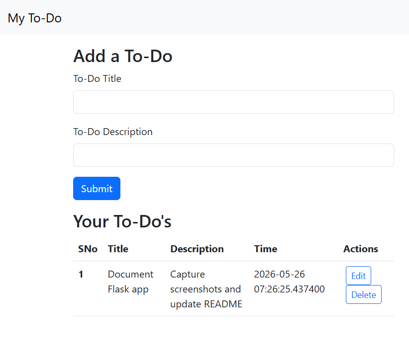
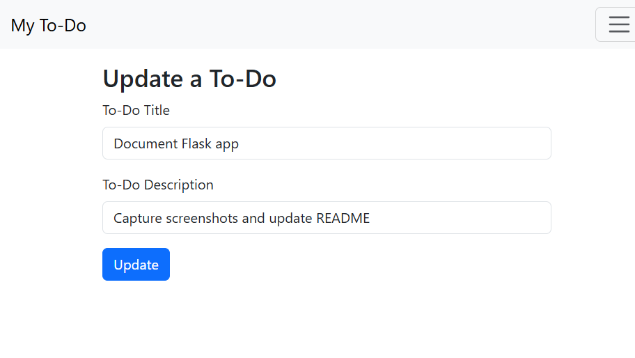

# Flask To-Do App

Flask To-Do App is a small web-based task tracker built with Flask and SQLAlchemy. It lets you add, edit, and delete to-do items from a simple Bootstrap interface backed by a local SQLite database.

## Core Features

- Create new to-do items with a title and description.
- View all saved items in a table on the home page.
- Edit existing items on a dedicated update screen.
- Delete items from the list.
- Automatically creates the SQLite database tables on first run.

## Architecture and Tech Stack

- Backend: Flask
- ORM: Flask-SQLAlchemy / SQLAlchemy
- Database: SQLite (`todo.db`)
- Frontend: Jinja templates with Bootstrap 5

## Screenshots

Main dashboard with saved tasks.


Edit form for updating an existing task.


## Setup and Run

1. Create and activate a virtual environment.
2. Install dependencies:

   ```bash
   pip install -r requirements.txt
   ```

3. Start the app:

   ```bash
   python main.py
   ```

4. Open the app in your browser at `http://127.0.0.1:8000`.

The database tables are created automatically on first run.
