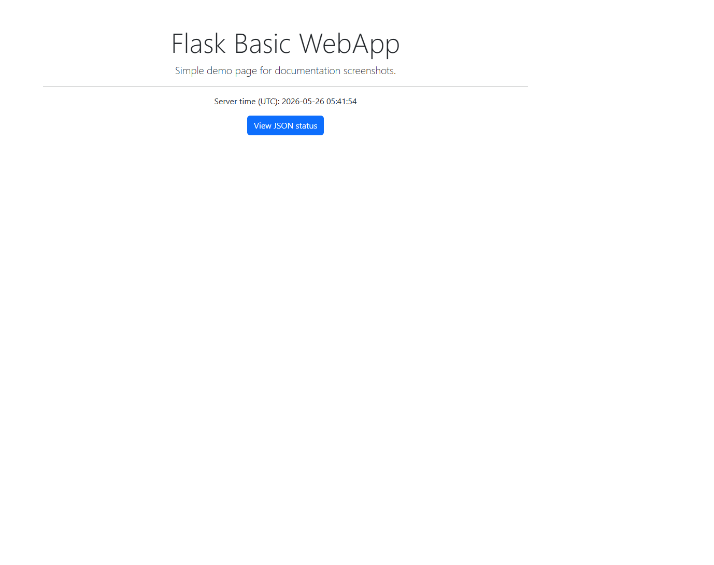
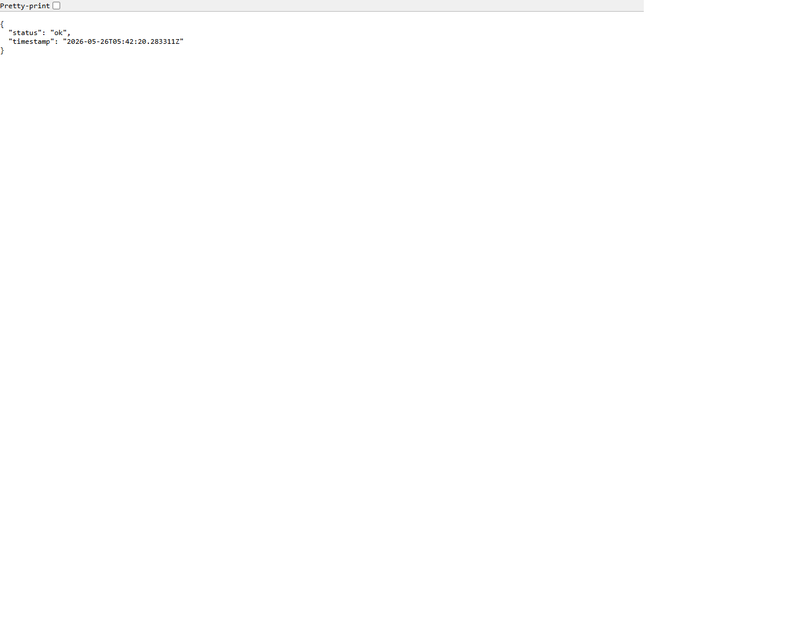

# Flask Webapp

A minimal Flask example project demonstrating an application factory, blueprint-based routes, and a simple test. Ideal for inclusion in a "Web Development Projects" collection and suitable as a starting point for automation-related tasks.

## Features

- Application factory (`create_app`) for easy testing and configuration
- Blueprint-based routing
- `pytest` test for the index route

## Quick start

1. Create a virtual environment and install dependencies:

```bash
python -m venv venv
venv\Scripts\activate
pip install -r requirements.txt
```

2. Run the app:

```bash
python -m flask_basic_webapp.run
```

3. Run tests:

```bash
pytest
```

<!--IMAGE:primary-->

You can also view the JSON status at `/status`.

<!--IMAGE:status-->


You can also view the JSON status at `/status`.


