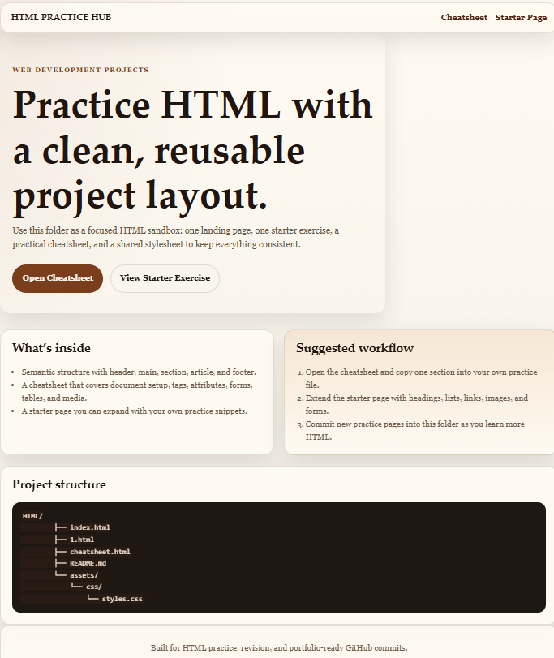
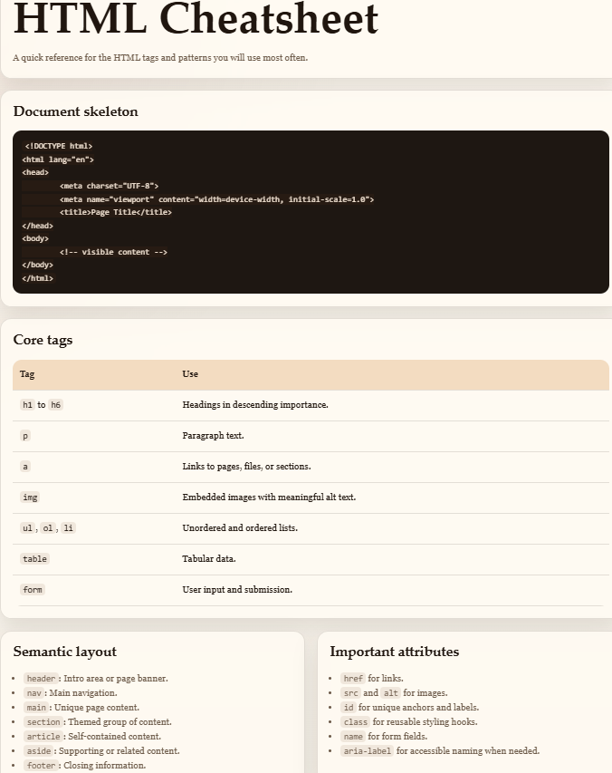
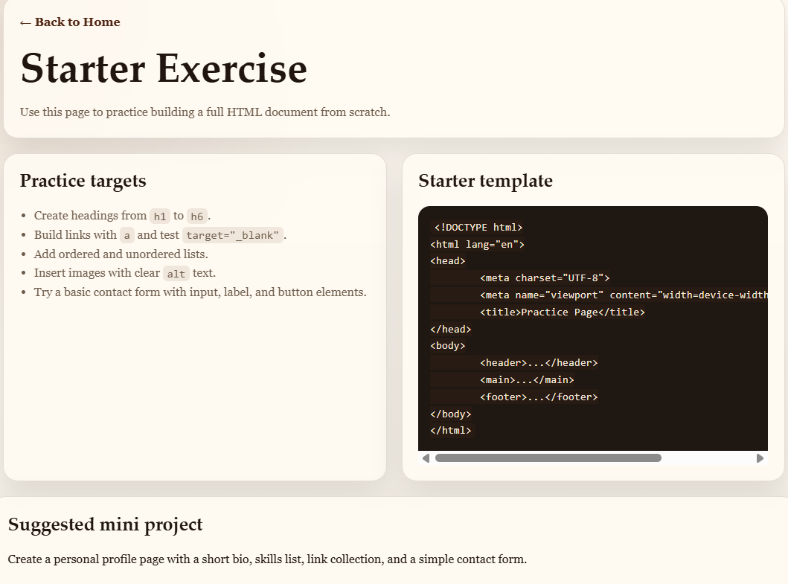

# HTML Practice Hub

A compact, self-contained HTML practice project for learning and quick experiments.

## Overview

- **Purpose:** Provide a small, opinionated playground with a landing page, a starter exercise, and a practical cheatsheet.
- **Interface:** Static web pages (open `index.html` in a browser).

## Core files

- `index.html` — Landing page and overview.
- `1.html` — Starter exercise page for hands-on practice.
- `cheatsheet.html` — Compact reference for common HTML patterns.
- `assets/css/styles.css` — Shared stylesheet with responsive layout and card components.

## Core features

- Semantic HTML structure demonstrating `header`, `main`, `section`, `article`, and `footer`.
- Readable, responsive CSS with a two-column grid layout and accessible components.
- Copy-ready code snippets and a starter template to expand as exercises.

## Tech / Architecture

- Plain HTML/CSS (no build step required).
- Designed for quick iteration and GitHub-friendly commits.

## Setup & Usage

1. Open `index.html` in your browser (double-click or use `file://` URL).
2. Navigate to **Cheatsheet** or **Starter Page** using the navigation links.
3. Edit or duplicate `1.html` to create new practice exercises.

### Screenshot assets

The README uses PNG screenshot assets stored in `assets/screenshots/`.

## Suggested visual captures

### Landing hero

### Cheatsheet sample

### Starter exercise

## Practice ideas

- Build a personal profile page.
- Create a landing page for a project.
- Make a contact form with validation.
- Add a table of skills, courses, or achievements.
